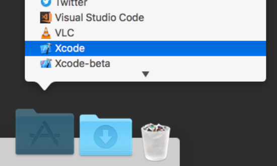
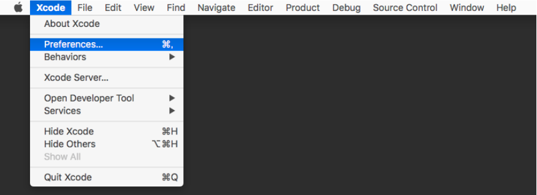
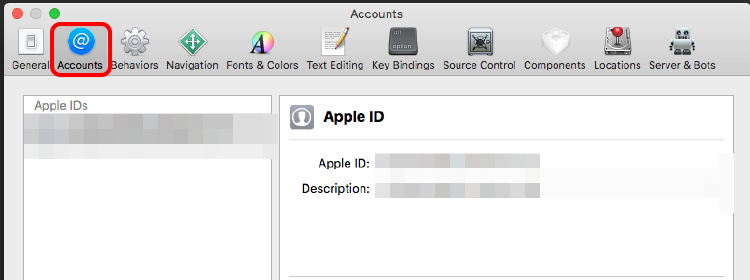
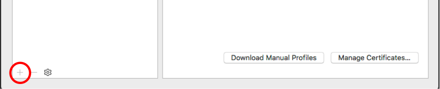
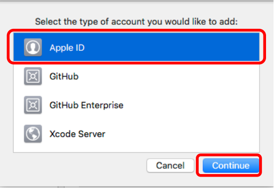
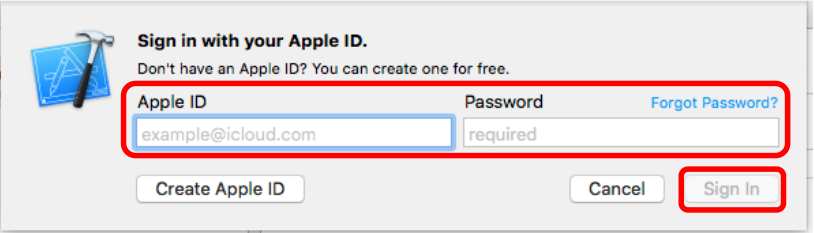
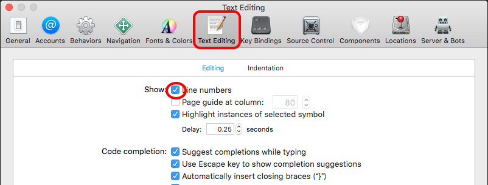
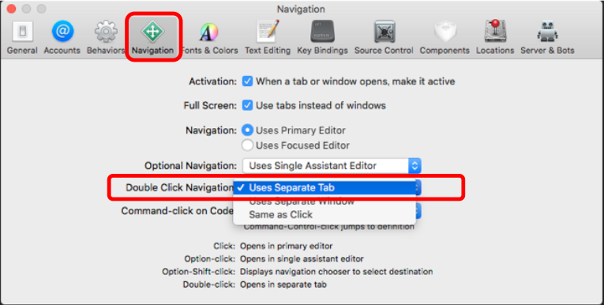

# Xcodeの初期設定

- 以下は、Xcode バージョン 9.3.1 で動作を確認済み。

## Xcodeを起動

- アプリケーション → Xcode と選んで起動する。

## Xcodeの初期設定

### 初期設定(1)

ここの設定をすると、iPhoneにアプリを転送できるようになる。

- Xcode → Preferences と選んで起動する。

- Accounts を選択する

- 左下にある「＋」を選択する。

- Apple ID を選択し、Continue を選択する。

- AppleIDのアカウントを設定し、Sign In を選択する。

※ 多要素認証の設定を聞かれる場合があるので、その場合は認証して登録する。

### 初期設定(2)

行表示をしたほうが見やすいので、行表示を設定する。

- Xcode → Preferences と選んで起動

- Text Editing の中の Line Number を選択する。

### 初期設定(3)

新しい画面が開く度に新規にWindowが起動するのは見にくくなるので、Double Click Navigation を設定する。

- Xcode → Preferences と選んで起動する。

- Navigation を選択し、Double Click Navigation の項目を、Users Separate Tab に設定する。

