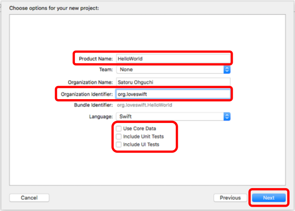
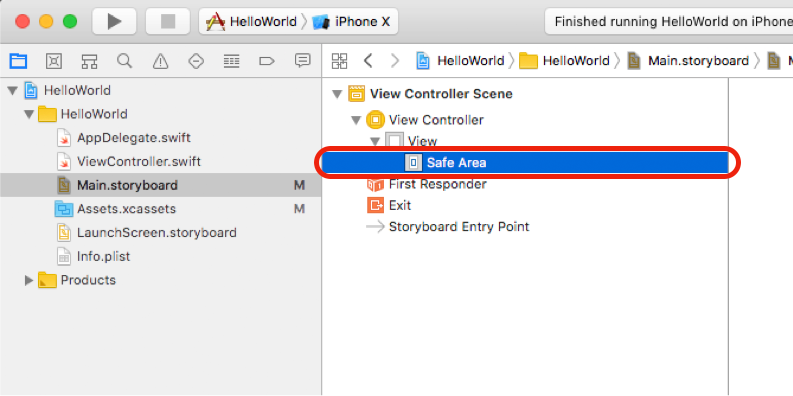
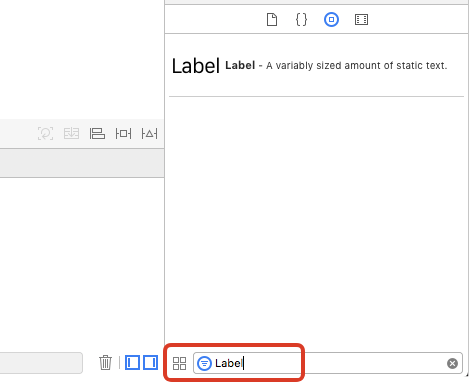
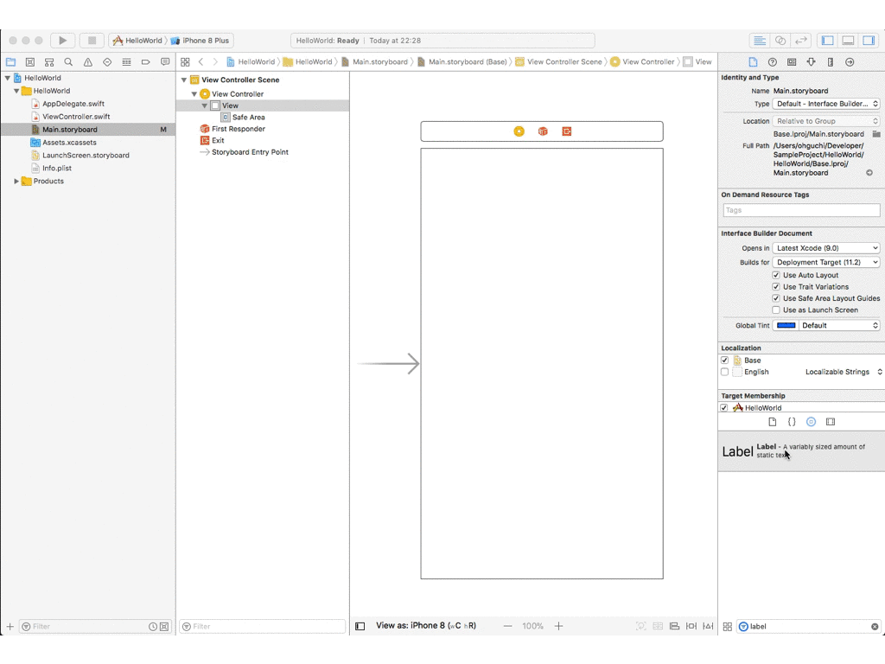
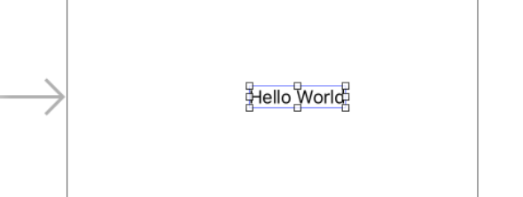
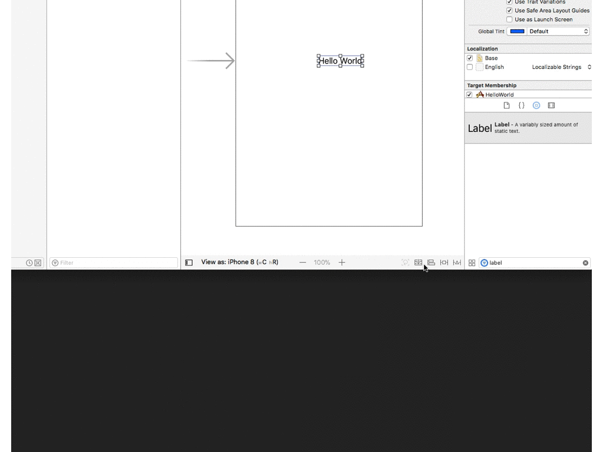
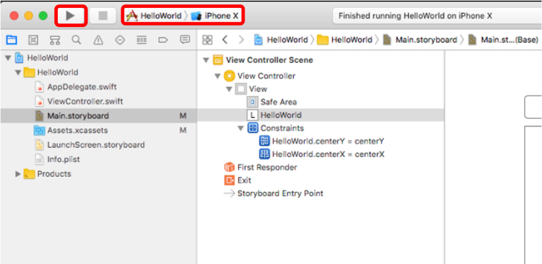

# Hello World を出してみよう

## プロジェクトを作成する

- Xcode のアプリを選択した状態にして、File → New → Project と選択する。

- アプリのタイプを選択する。Single View App → Next を選択する。

- プロジェクトの設定を記入する。Product Name、Organization identifier を設定し、Use Core Data、include Unit Tests、include UI Tests のチェックを外す。

- 保管場所を選択する。Source Control のチェックは付けておいてOK。

## Hello World を表示する設定をする

- Xcode上で、プロジェクトが開かれるので、左のツリーを開いて、Storyboard を選択する。

- SafeArea を選択する。

- Xcode の右下にある画面の画面で、「show the object library」を選択する。

- Filter に Label と入力し、Label が表示されることを確認する。

- ラベルをドラッグしてラベルを配置する。

- Hello World に文字列を書き換える。

- 制約を設定し、画面の中央に設定されるように設定する。

- 下記のようになることを確認する。

## 動作を確認する

- Xcode の上の方で、iPhoneX のシミュレーターを起動して確認する。

