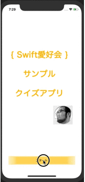
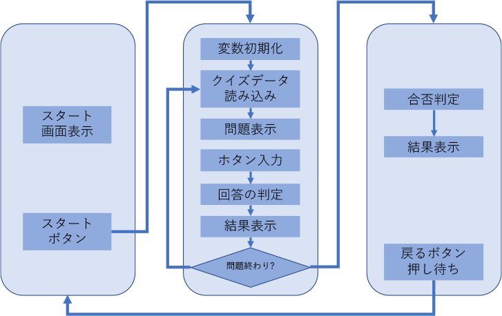

# クイズアプリの概要説明

## 完成図

- 以下のようなアプリを作成する。

## 素材のダウンロード

- 事前に用意している素材をダウンロードする。
    - [ViewControllerに置く素材](../etc/material.zip)
    - [問題のCSV](../etc/quiz.zip)

## 全体的な処理の流れ

- 今回のアプリの処理の流れを以下に示す。タイトル画面、クイズを実行する画面、結果を表示する画面の3つから構成される。

