# クイズアプリの Storyboard の設定(3/5)

## ゲーム画面の作成

- 画面は以下のように設計されている

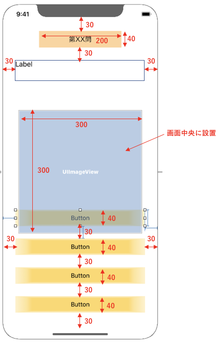

- Xcode上で、左のツリーから、Storyboard を選択する。


- 問題番号のLabelを配置する。Labelを配置する。

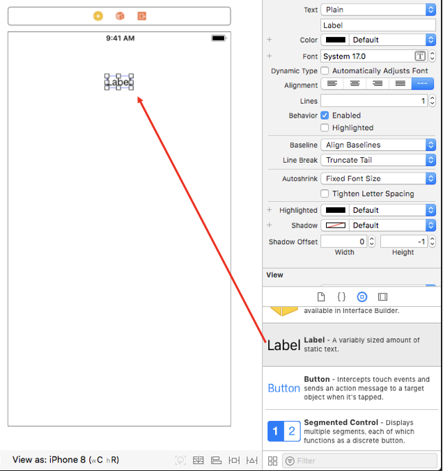

- Labelの背景カラーを好きな色に指定する。

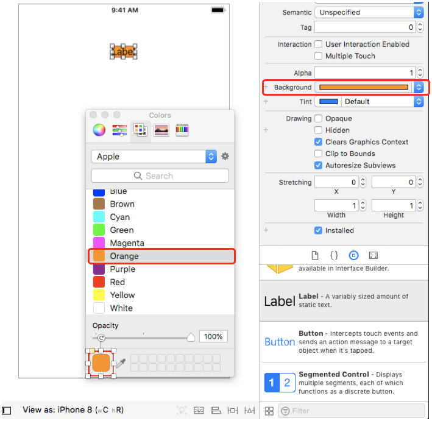

- 文字列のアラインメントを中央に設定する。

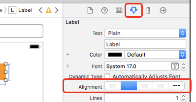

- ラベルの制約を指定する。Add new constraints を選択し、Width を 200、Height を、40 に指定し、上からは、30 の位置に配置されるように制約を設定し、Add 3 Constraints を選択する。

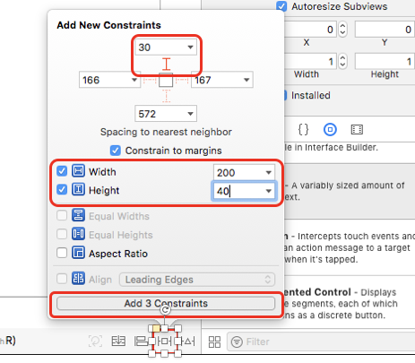

- Align を選択して、Horizontally in Container にチェックを入れて、Add 1 Constraint を選択する。

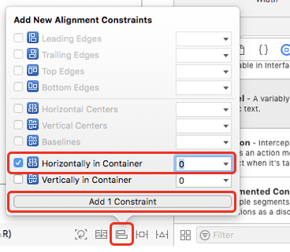

- 問題文を表示するLabelを配置する。Labelを配置して、Lines（行数）を5に指定する。

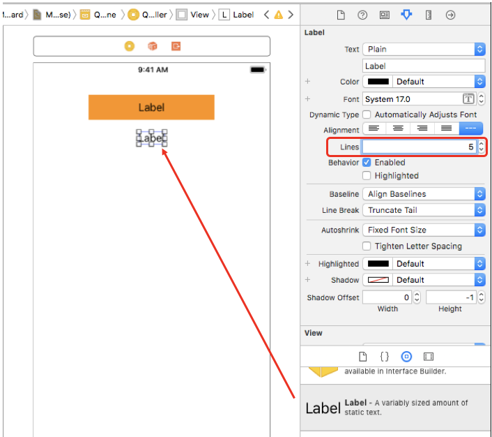

- ラベルの制約を指定する。Add New Constraints を選択し、上左右から、30 の位置に配置されるように制約を設定し、Add 3 Constraints を選択する。

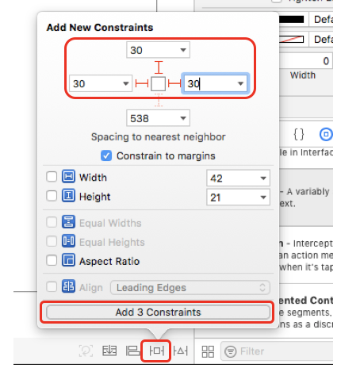

- Button を配置し、Background を、ButtonIcon と指定する。

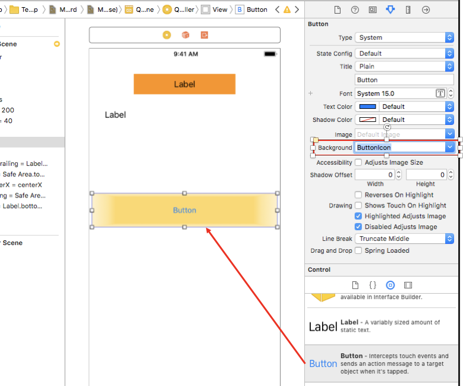

- 上記を繰り返し、4つ並べる

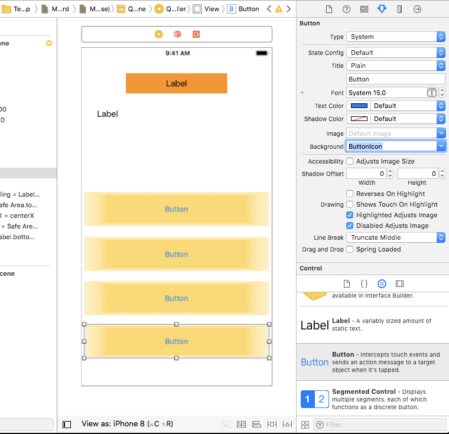

- Button の Tag を指定する。一番上から、1、2、3、4 と指定する。(スクリーンショットは、2までですが、全て指定のこと。)


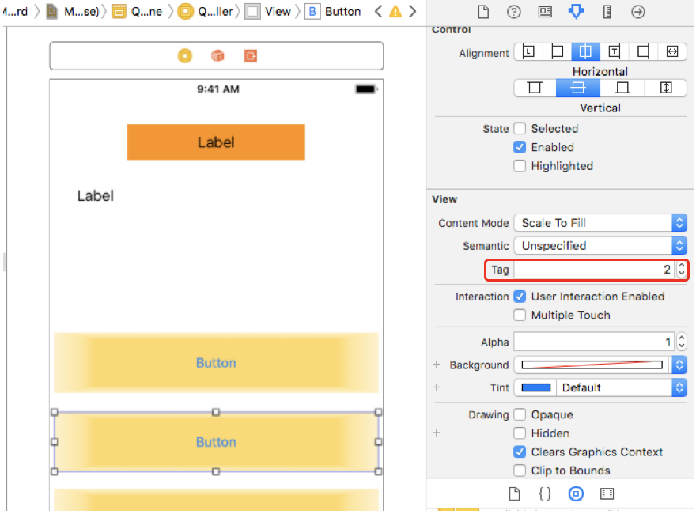

- Button の制約を設定する。一番下のボタンを選択、Add New Constraints を選択し、下左右から、30 の位置に配置されるように制約を設定し、Height を 40 に設定し、Add 4 Constraints を選択する。

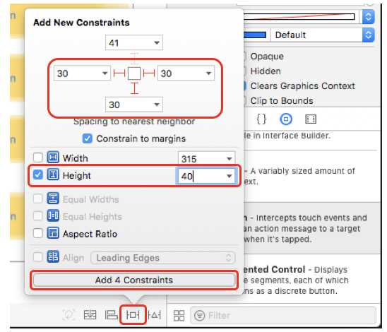

- 同様に下から、2番目、3番目、4番目も制約を設定する。

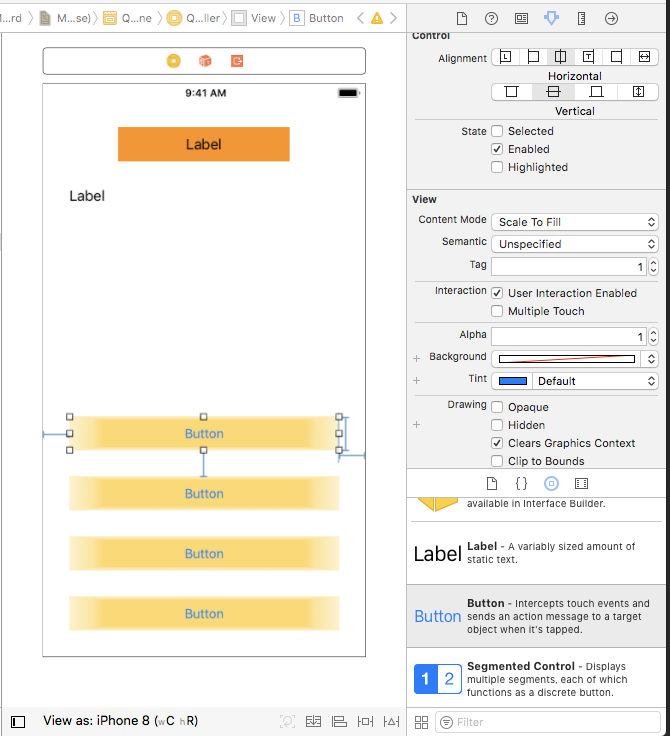

- IBOutlet を接続する。まずは、Show the Assitant editer を選択して、2画面表示へ切り替える。

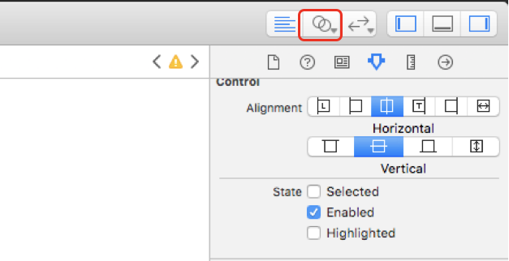

- 上の1番目のラベルを選択し、controlキーを押しながら、右側に表示されたコードに向けて、ドラッグ＆ドロップすると、ウィンドウが表示されるので、Nameに「quizNumberLabel」 と指定し、connect を選択する。


- 同様に上から2番目のラベルを選択し、controlキーを押しながら、右側に表示されたコードに向けて、ドラッグ＆ドロップすると、ウィンドウが表示されるので、Nameに「quizQuestionLabel」 と指定し、connect を選択する。

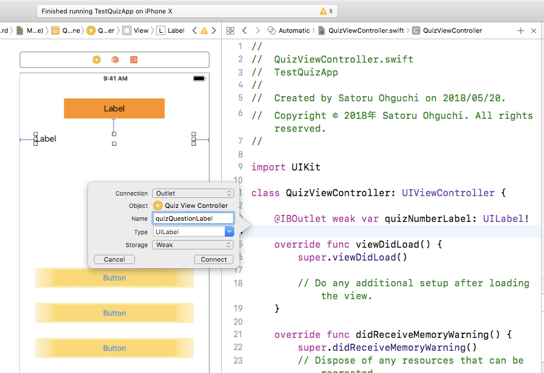

- ボタンも同様に、IBOutlet を設定する。一番上のボタンを選択し、controlキーを押しながら、右側に表示されたコードに向けて、ドラッグ＆ドロップすると、ウィンドウが表示されるので、NameにｐuiButton1」 と指定し、connect を選択する。


- 同様に、各ボタンを選択し、controlキーを押しながら、右側に表示されたコードに向けて、ドラッグ＆ドロップすると、ウィンドウが表示されるので、上から順に、Nameに「uiButton2」、「uiButton3」、「uiButton4」 と指定する。

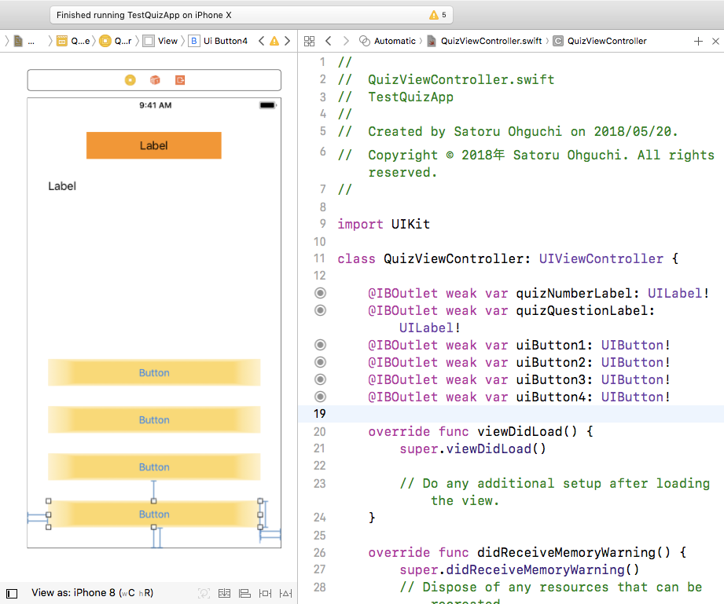

- IBAction を設定する。下記のコードを、QuizViewController 上に配置する。

```
// 正誤判定
@IBAction func btnAction(_ sender: UIButton) {
    // 後で追加する。
}
```

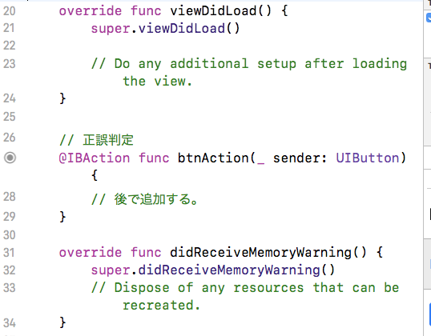

- IBActionの横にある丸いボタンから、各ボタンに向けて、ドラッグ&ドロップして接続する。

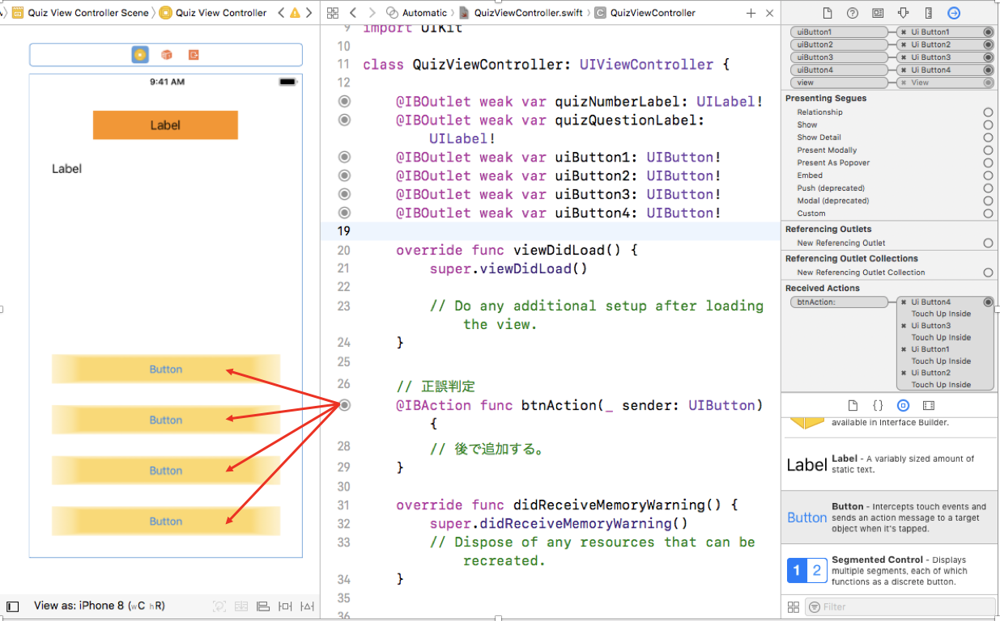

- Storyboard に戻って、Image View を選択して、画面中央付近に配置する。

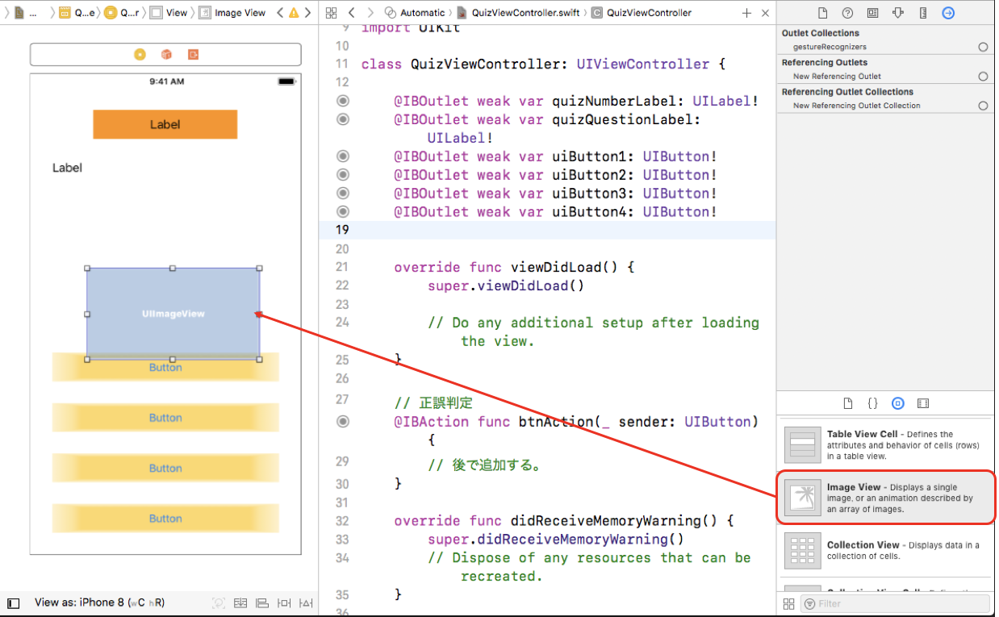

- 制約を指定します。Add New Constraints を選択し、Width と、Height を、300　に指定して、Add 2 Constraints を選択する。

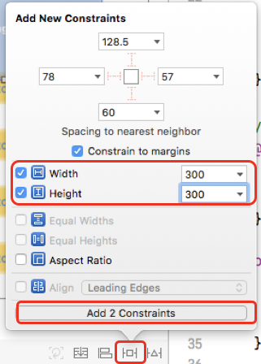

- Align を選択して、Horizontally in Container と、Vertivally in Container の両方にチェックを入れて、Add 2 Constraints を選択する。

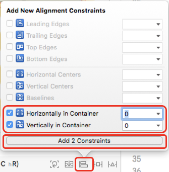

- IBOutlet を接続する。Image View を選択して、controlキーを押しながら、右側に表示されたコードに向けて、ドラッグ＆ドロップすると、ウィンドウが表示されるので、Nameに「answerImage」 と指定し、connect を選択する。

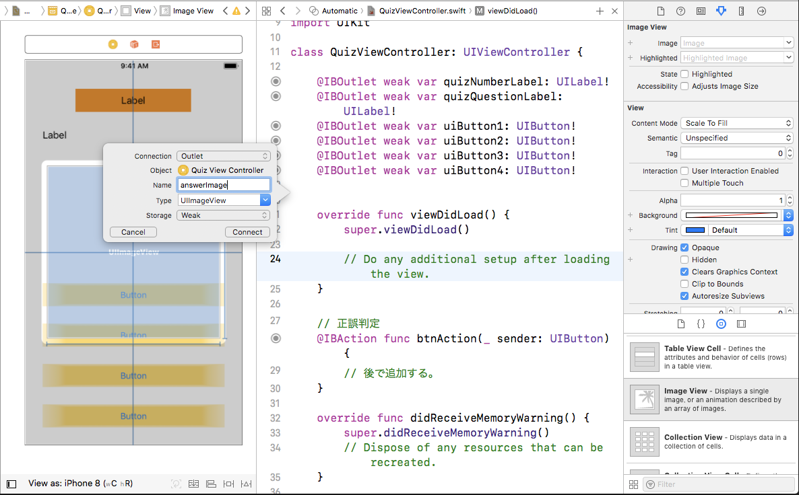

- コードにコメントを記入する。(// で始まる部分)

```
// 問題表示の接続 　　← これを追加
@IBOutlet weak var quizNumberLabel: UILabel!
@IBOutlet weak var uiButton1: UIButton!
@IBOutlet weak var uiButton2: UIButton!
@IBOutlet weak var uiButton3: UIButton!
@IBOutlet weak var uiButton4: UIButton!
@IBOutlet weak var quizQuestionLabel: UILabel!
    
// 正誤表示 　　← これを追加
@IBOutlet weak var answerImage: UIImageView!
```

- Show the Standard editer を押して元に戻します。

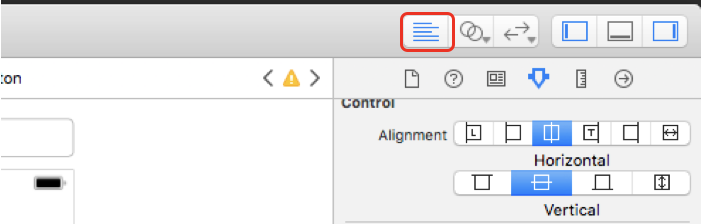
