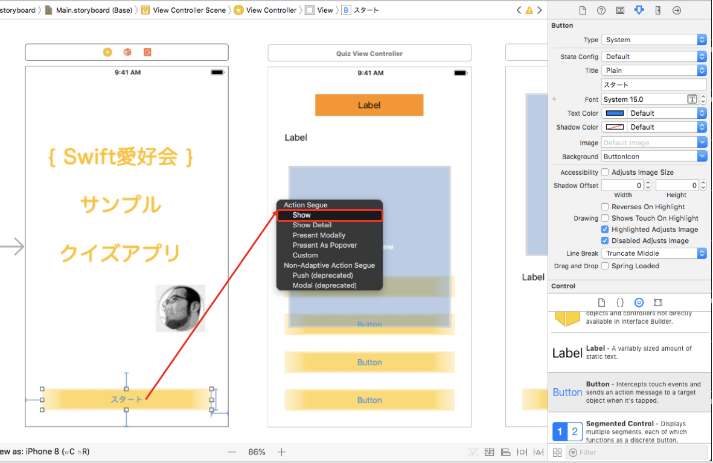
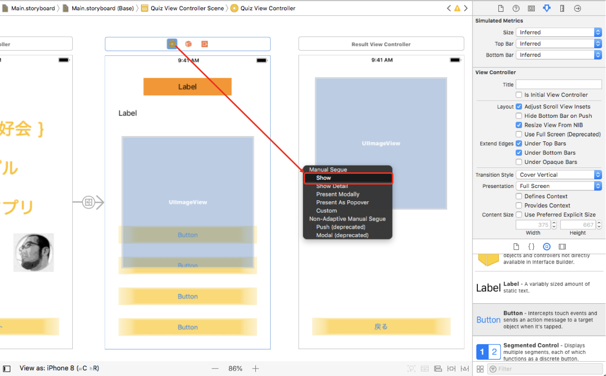
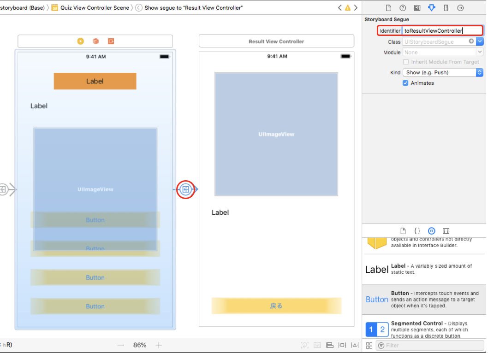

# クイズアプリの Storyboard の設定(5/5)

## Segue の設定をする

- タイトル画面からクイズ画面への遷移の設定をする。「スタート」ボタンを選択し、controlキーを押しながら、右側の QuizViewController で離すと、Action Segue と出るので、「Show」 を選択する。

- ゲーム画面から結果表示画面への遷移の設定をする。画面上の「Quiz View Controller」と出るところを選択し、controlキーを押しながら、右側の ResultViewController で離すと、Manual Segue と出るので、「Show」 を選択する。

- ゲーム画面から結果表示画面への Segue を選択し、StoryBoard Segue の Identifier に、「toResultViewController」 と設定する。

