# クイズアプリの StoryBoard の設定

## StoryBoard への素材の取り込みと配置

- StoryBoard に配置した結果は以下となる。


## プロジェクトを新たに新規作成する

- Xcode のアプリを選択した状態にして、File → New → Project と選択する。


- アプリのタイプを選択する。Single View App → Next を選択する。


- プロジェクトの設定を記入する。Product Name、Organization identifier を設定し、Use Core Data、include Unit Tests、include UI Tests のチェックを外す。


- 保管場所を選択する。Source Control のチェックは付けておいてOK。


## 素材の取り込み

- ダウンロードした素材を取り込む。Assets.xcassets を選択する。


- ダウンロードしたフォルダからドラッグ＆ドロップをして素材を取り込む。


- 以下のようになる。


## ViewController を配置する

- Xcode上で、左のツリーから、Storyboard を選択する。


- Xcode の右下にある画面の画面で、「show the object library」を選択する。


- StoryBoard上にドラッグ&ドロップをして、2つ追加して並べる。


- 以下の画面のように配置する。


## 各画面用のプログラムコードを準備する

- File → New → File を選択する。


- Cocoa Touch Class を選択する。


- クラスを QuizViewController と指定する。


- 「Create」を選択する。


- 同様に、再度、File → New → File を選択する。


- Cocoa Touch Class を選択する。


- クラスを ResultViewController と指定する。


- 「Create」を選択する。


## ViewContoller にコードを割り当てる。

- Xcode上で、左のツリーから、Storyboard を選択する。


- 真ん中に並べた ViewController を選択する。


- Show the indentify inspector を選択する。


- Custom Class の項目に、QuizViewController と入れる。


- 右側に置いた ViewController を選択する。


- Show the indentify inspector を選択する


- Custom Class の項目に、ResultViewController と入れる。


## タイトル画面の作成

- 画面は以下のように設計されている

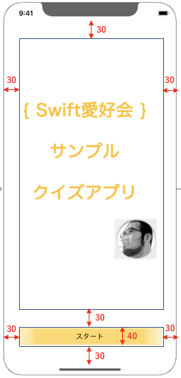

- Xcode上で、左のツリーから、Storyboard を選択する。


- ImageView を配置する。右下の object library から、ImageView を選択して配置する。

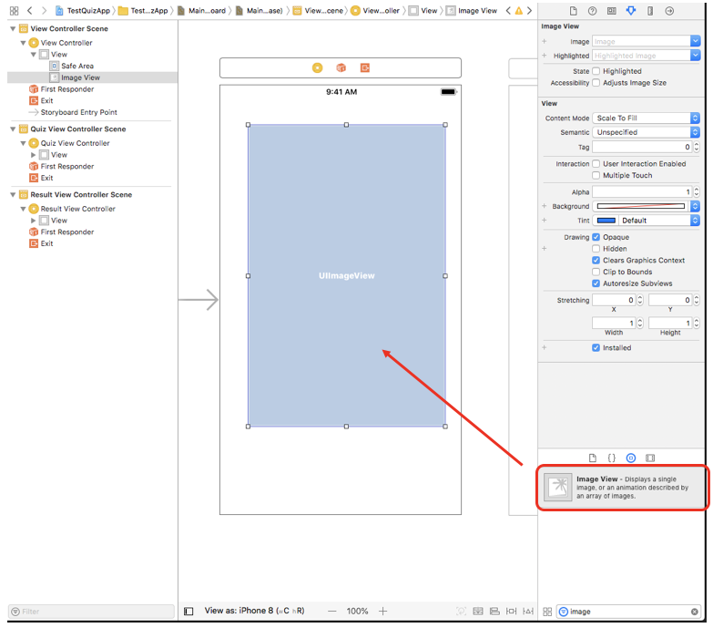

- ImageView の表示内容を設定する。右上の Attribute inspector を選択し、Image を Top_Logo と設定し、Content Mode を Aspect Fit とする。

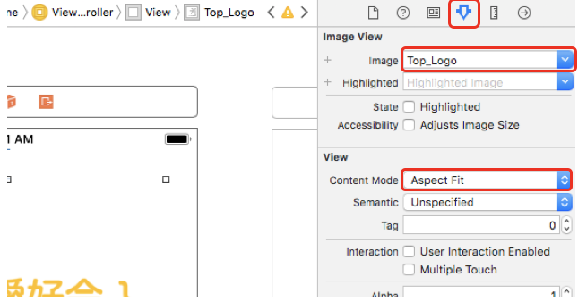

- Button を配置する。右下の object library から、Button を選択して配置する。


- Button の文字列を「スタート」と設定する。

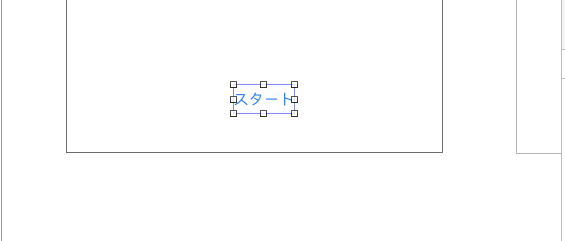

- Button の表示内容を設定する。右上の Attribute inspector を選択し、Background を ButtonIcon と設定する。 

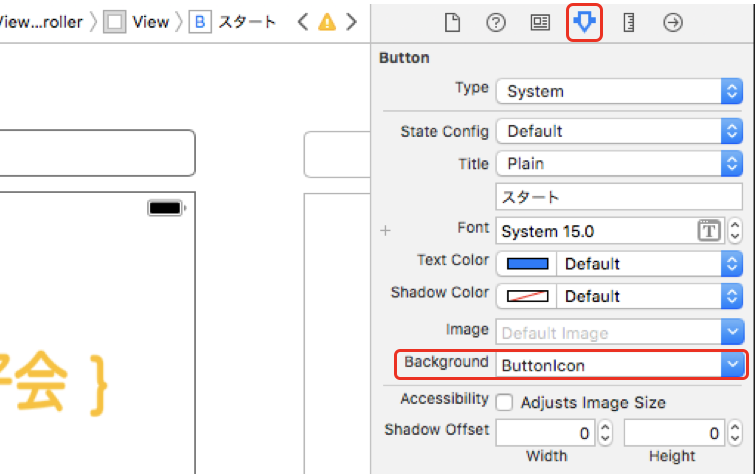

- ImageView の制約を設定する。ImageView を選択する。

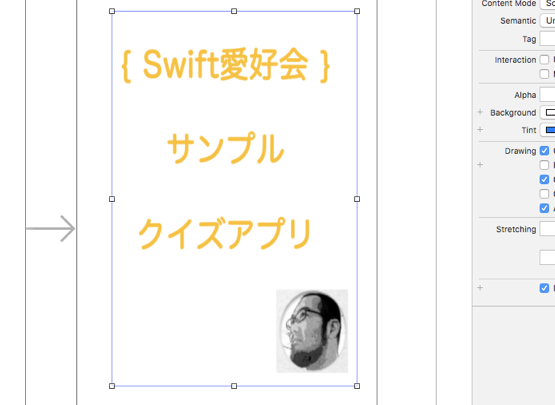

- Add new constraints を選択し、上下左右の制約に、30の値を入れ、Add 4 Constraints を選択する。


- Button の制約を設定する。「スタート」を選択し、Add new constraints を選択し、下左右の制約に、30の値を入れ、高さに、40 を指定し、Add 4 Constraints を選択する。

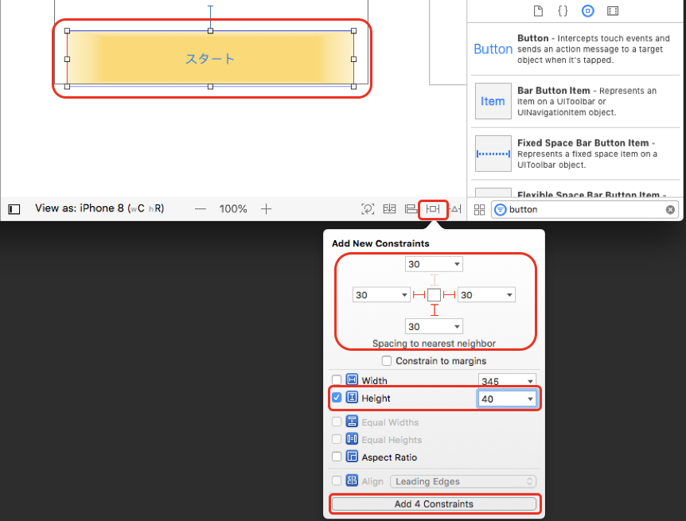

- Xcode の上の方で、「▶」を押して、iPhoneX のシミュレーターを起動して表示を確認する


## ゲーム画面の作成

- 画面は以下のように設計されている


- Xcode上で、左のツリーから、Storyboard を選択する。


- 問題番号のラベルを配置する。ラベルを配置する。


- ラベルの背景カラーを好きな色に指定する。


- 文字列を中央に配置する。


- ラベルの制約を指定する。Add new constraints を選択し、Width を 200、Height を、40 に指定し、上からは、30 の位置に配置されるように制約を設定し、Add 3 Constraints を選択する。


- Align を選択して、Horizontally in Container にチェックを入れて、Add 1 Constraints を選択する。


- 問題文を表示するラベルを配置する。ラベルを配置して、行数を5に指定する。


- ラベルの制約を指定する。Add new constraints を選択し、上左右から、30 の位置に配置されるように制約を設定し、Add 3 Constraints を選択する。


- Button を配置し、Background を、Buttonicon と指定する。


- 上記を繰り返し、4つ並べる


- Button の Tag を指定する。一番上から、1、2、3、4 と指定する。(スクリーンショットは、2までですが、全て指定のこと。)


- Button の制約を設定する。一番下のボタンを選択、Add new constraints を選択し、下左右から、30 の位置に配置されるように制約を設定し、Height を 40 に設定し、Add 4 Constraints を選択する。


- 同様に下から、2番目、3番目、4番目も制約を設定する。


- IBOutlet を接続する。まずは、Show the Assitant editer を選択して、2画面表示へ切り替える。


- 上の1番目のラベルを選択し、controlキーを押しながら、右側に表示されたコードに向けて、ドラッグ＆ドロップすると、ウィンドウが表示されるので、quizNumberLabel と指定し、connect を選択する。


- 同様に上から2番目のラベルを選択し、controlキーを押しながら、右側に表示されたコードに向けて、ドラッグ＆ドロップすると、ウィンドウが表示されるので、quizQuestionLabel と指定し、connect を選択する。


- ボタンも同様に、IBOutlet を設定する。一番上のボタンを選択し、controlキーを押しながら、右側に表示されたコードに向けて、ドラッグ＆ドロップすると、ウィンドウが表示されるので、uiButton1 と指定し、connect を選択する。


- 同様に、各ボタンを選択し、controlキーを押しながら、右側に表示されたコードに向けて、ドラッグ＆ドロップすると、ウィンドウが表示されるので、上から順に、uiButton2、uiButton3、uiButton4 と指定する。


- IBAction を設定する。下記のコードを、QuizViewController 上に配置する。

```
// 正誤判定
@IBAction func btnAction(_ sender: UIButton) {
    // 後で追加する。
}
```


- IBActionの横にある丸いボタンから、各ボタンに向けて、ドラッグ&ドロップして接続する。


- StoryBoard に戻って、ImageView を選択して、画面中央付近に配置する。


- 制約を指定します。Add new constraints を選択し、Width と、Height を、300　に指定して、Add 2 Constraints を選択する。


- Align を選択して、Horizontally in Container と、Vertivally in Container の両方にチェックを入れて、Add 2 Constraints を選択する。


- IBOutlet を接続する。ImageView を選択して、controlキーを押しながら、右側に表示されたコードに向けて、ドラッグ＆ドロップすると、ウィンドウが表示されるので、answerImage と指定し、connect を選択する。


- コードにコメントを記入する。(// で始まる部分)

```
// 問題表示の接続 　　← これを追加
@IBOutlet weak var quizNumberLabel: UILabel!
@IBOutlet weak var uiButton1: UIButton!
@IBOutlet weak var uiButton2: UIButton!
@IBOutlet weak var uiButton3: UIButton!
@IBOutlet weak var uiButton4: UIButton!
@IBOutlet weak var quizQuestionLabel: UILabel!
    
// 正誤表示 　　← これを追加
@IBOutlet weak var answerImage: UIImageView!
```

- Show the Standard editer を押して元に戻します。


## 結果表示画面の作成

- 画面は以下のように設計されている

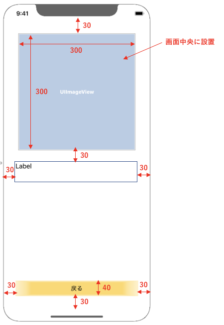

- Xcode上で、左のツリーから、Storyboard を選択する。


- ImageView を配置する。Content Mode を、Aspect Fit と指定する。

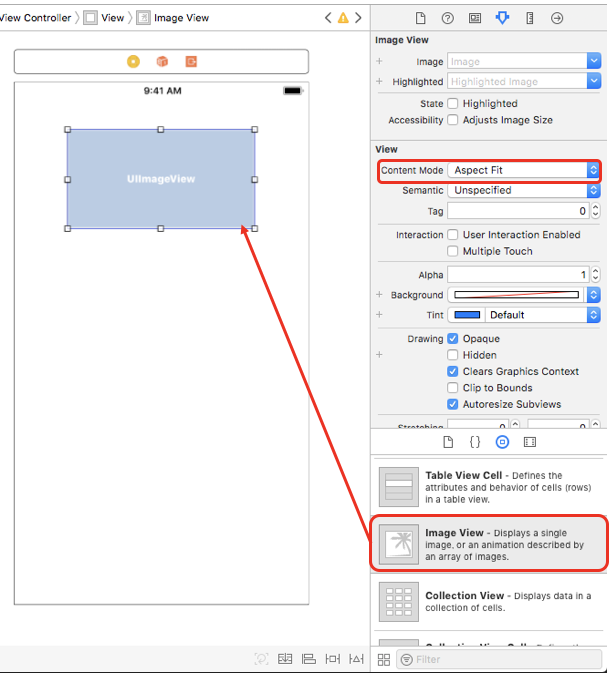

- ImageView の制約を設定する。Add new constraints を選択し、上を、30 と設定し、Width と、Height を、300　に指定し、Add 3 Constraints を選択する。

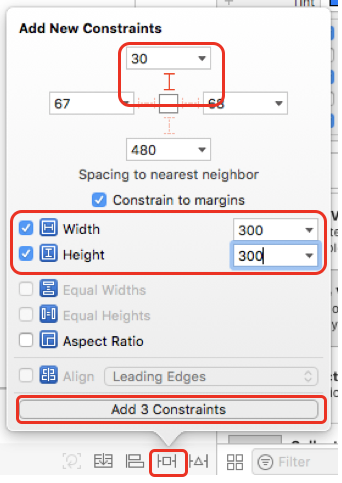

- Align を選択して、Horizontally in Container にチェックを入れて、Add 1 Constraints を選択する。

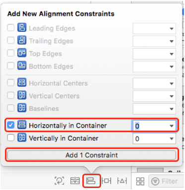

- Label を配置する。Line を 3 に設定する。

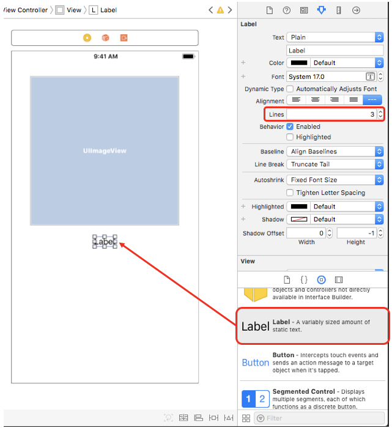

- Label の制約を設定する。Add new constraints を選択し、上左右から、30 の位置に配置されるように制約を設定し、Add 3 Constraints を選択する。


- Button を配置し、テキストを「戻る」と変更し、Background を、Buttonicon と指定する。

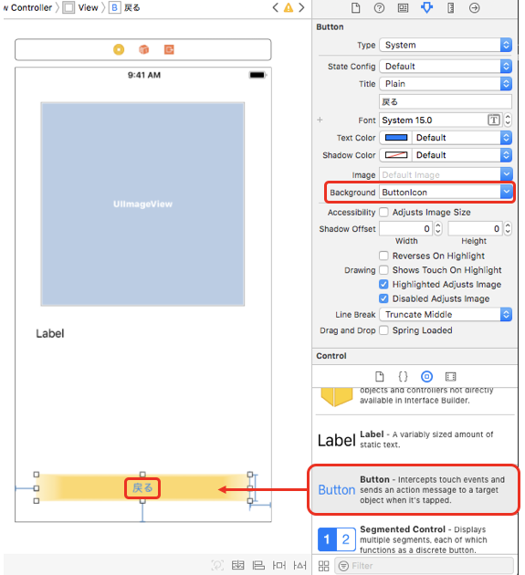

- Button の制約を設定する。一番下のボタンを選択、Add new constraints を選択し、下左右から、30 の位置に配置され、Height を 40 とするように制約を設定し、Add 4 Constraints を選択する。

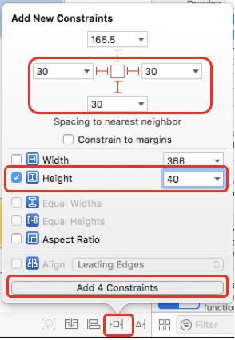

- IBOutlet を接続する。まずは、Show the Assitant editer を選択して、2画面表示へ切り替える。


- ImageView を選択して、controlキーを押しながら、右側に表示されたコードに向けて、ドラッグ＆ドロップすると、ウィンドウが表示されるので、resultImageView と指定し、connect を選択する。

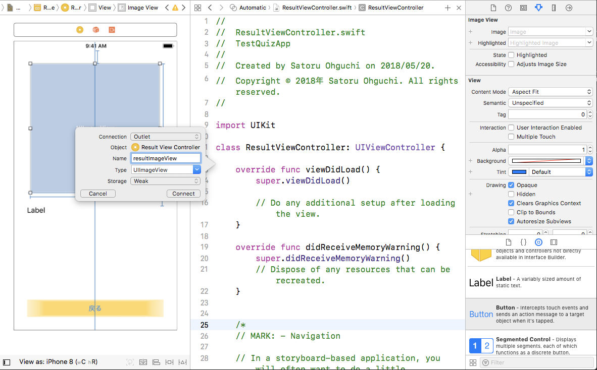

- Label を選択して、controlキーを押しながら、右側に表示されたコードに向けて、ドラッグ＆ドロップすると、ウィンドウが表示されるので、resultLabel と指定し、connect を選択する。

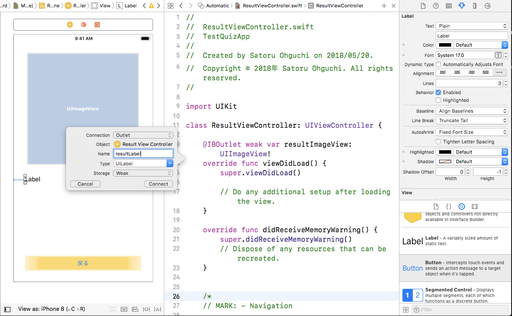

- コードにコメントを記入する。(// で始まる部分)

```
// IBOutlet 　　← これを追加
@IBOutlet weak var resultImageView: UIImageView!    
@IBOutlet weak var resultLabel: UILabel!
```

- Show the Standard editer を押して元に戻します。


## Segue の設定をする

- タイトル画面からクイズ画面への遷移の設定をする。「スタート」ボタンを選択し、controlキーを押しながら、右側の QuizViewController で離すと、Action Segue と出るので、Show を選択する。


- ゲーム画面から結果表示画面への遷移の設定をする。画面上の「Quiz View Controller」と出るところを選択し、controlキーを押しながら、右側の ResultViewController で離すと、Manual Segue と出るので、Show を選択する。


- ゲーム画面から結果表示画面への Segue を選択し、StoryBoard Segue の Identifier に、toResultViewController と設定する。


