# クイズアプリの Storyboard の設定(1/5)

## Storyboard への素材の取り込みと配置

- StoryBoard に配置した結果は以下となる。

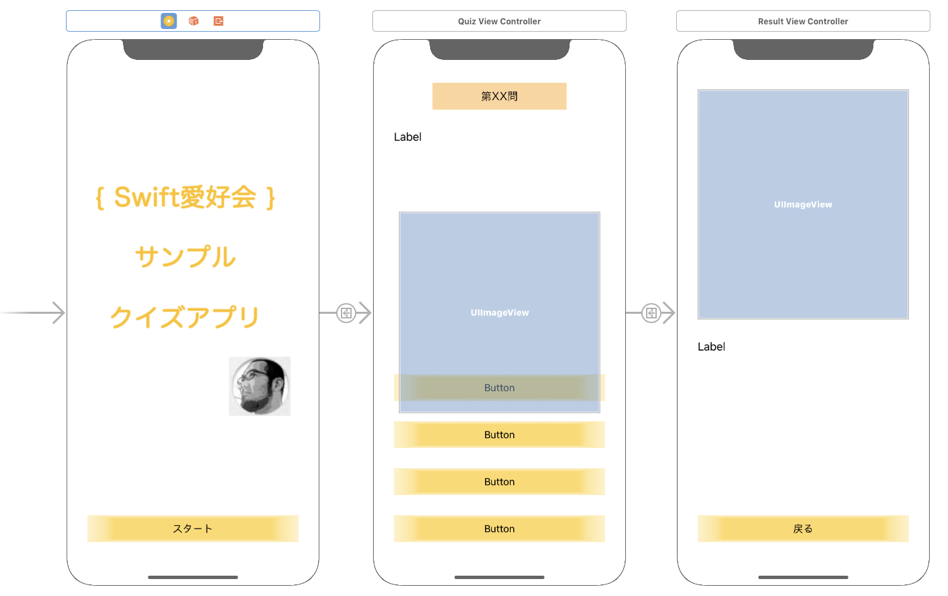

## プロジェクトを新たに新規作成する

- Xcode のアプリを選択した状態にして、File → New → Project... と選択する。

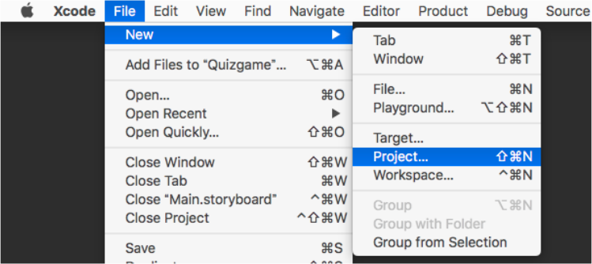

- アプリのタイプを選択する。iOS → Single View App → Next を選択する。

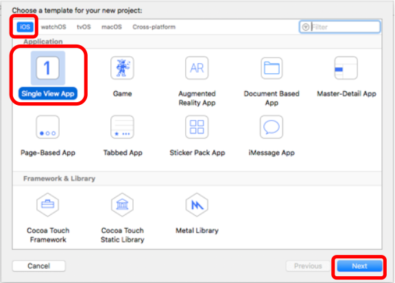

- プロジェクトの設定を記入する。Product Name、Organization Identifier を設定し、Use Core Data、include Unit Tests、include UI Tests のチェックを外す。

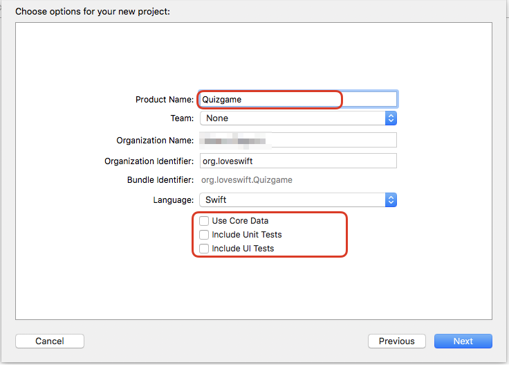

- 保存場所を選択する。Source Control のチェックは付けておいてOK。

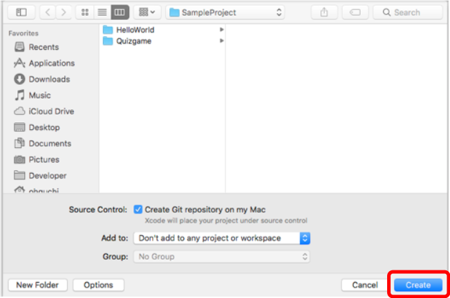

## 素材の取り込み

- ダウンロードした素材を取り込む。Assets.xcassets を選択する。

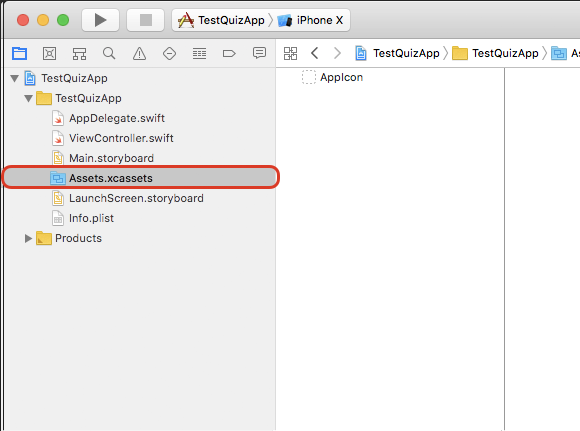

- ダウンロードしたフォルダからドラッグ＆ドロップをして素材を取り込む。

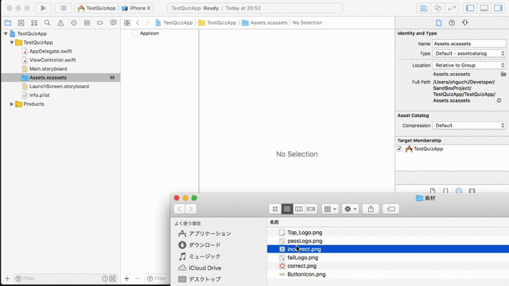

- 以下のようになる。

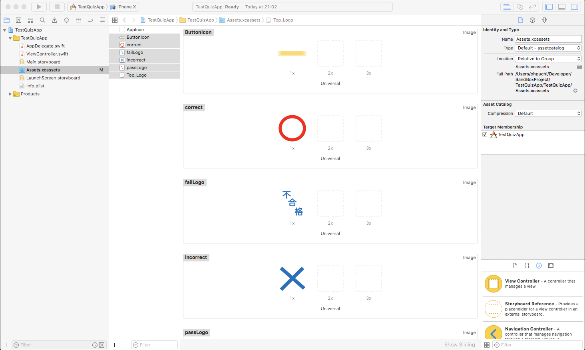

## ViewController を配置する

- Xcode上で、左のツリーから、Storyboard（Main.storyboard） を選択する。

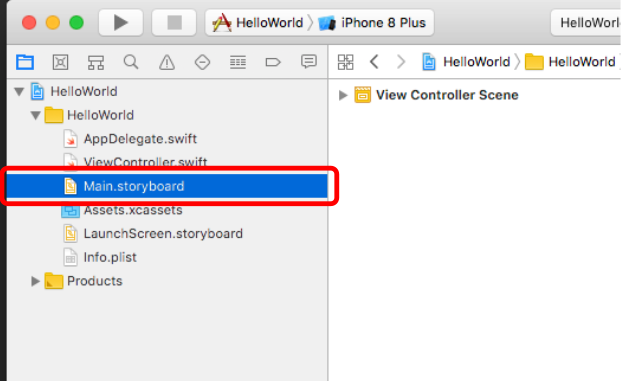

- Xcode の右下にある画面の画面で、「Show the Object library」を選択する。

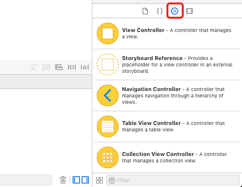

- Storyboard上にドラッグ&ドロップをして、2つ追加して並べる。

- 以下の画面のように配置する。

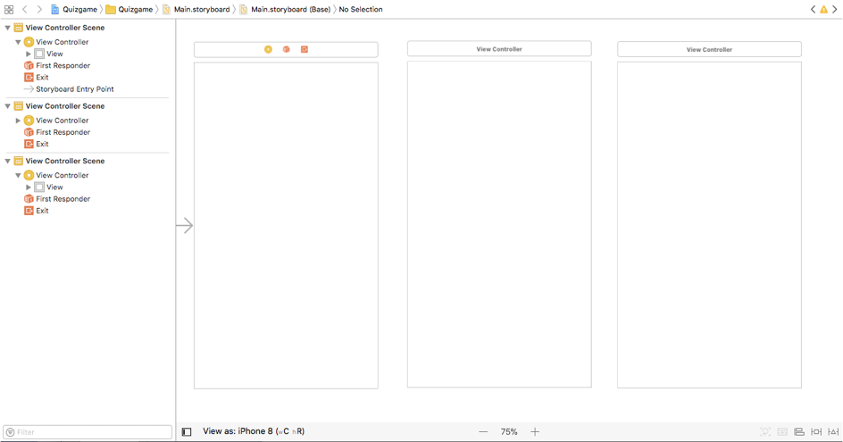

## 各画面用のプログラムコードを準備する

- File → New → File... を選択する。

- Cocoa Touch Class を選択する。

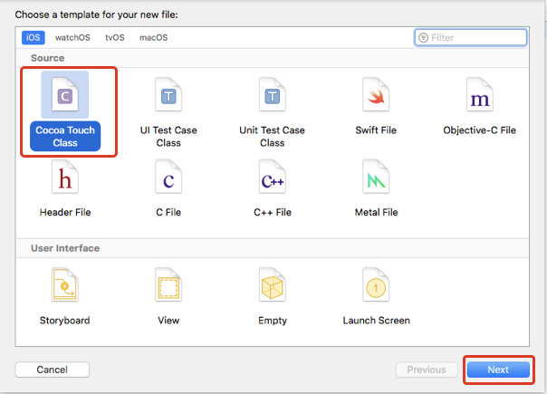

- Class: を 「QuizViewController」 と指定する。

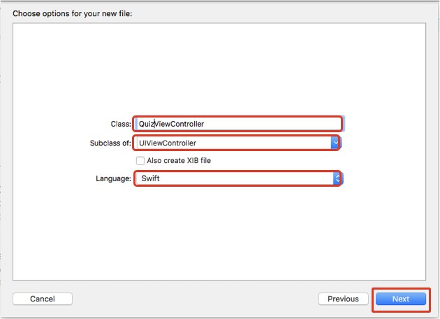

- 「Create」を選択する。

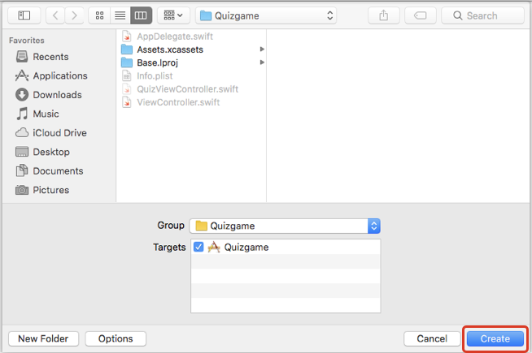

- 同様に、再度、File → New → File... を選択する。

- Cocoa Touch Class を選択する。

- Class: を 「ResultViewController」 と指定する。

- 「Create」を選択する。

## ViewContoller にコードを割り当てる。

- Xcode上で、左のツリーから、Storyboard を選択する。

- 真ん中に並べた ViewController を選択する。

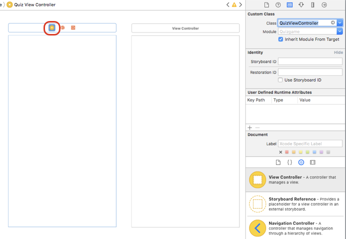

- Show the Indentify inspector を選択する。

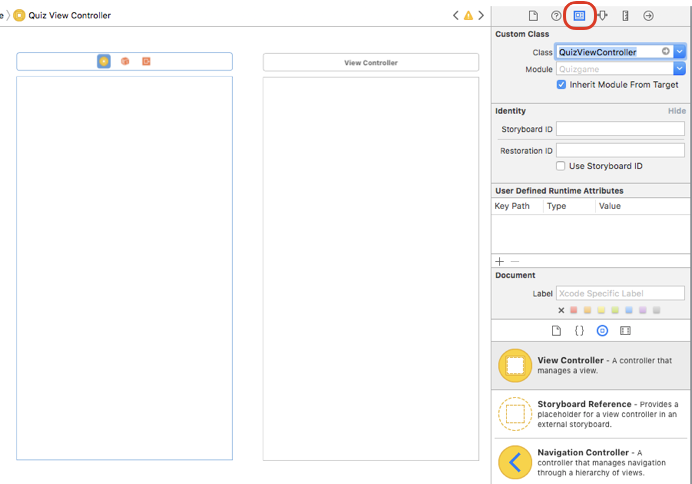

- Custom Class の項目に、「QuizViewController」 と入れる。

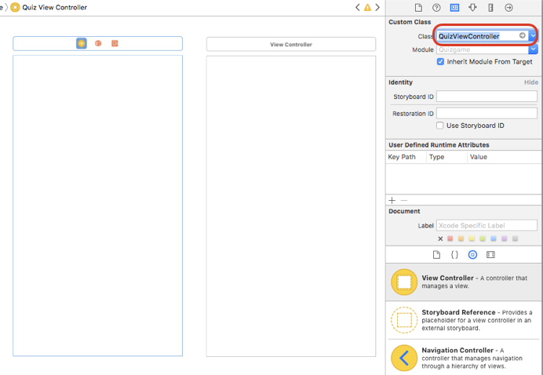

- 右側に置いた ViewController を選択する。

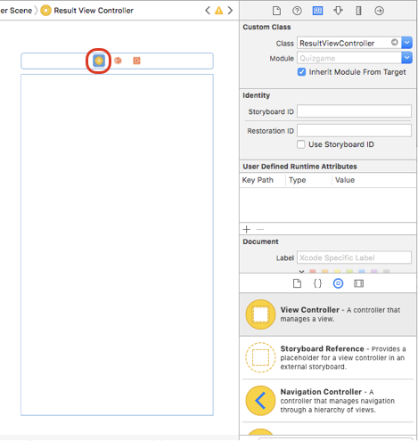

- Show the Indentify inspector を選択する

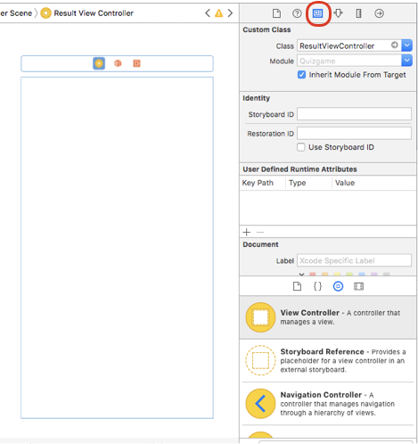

- Custom Class の項目に、「ResultViewController」 と入れる。

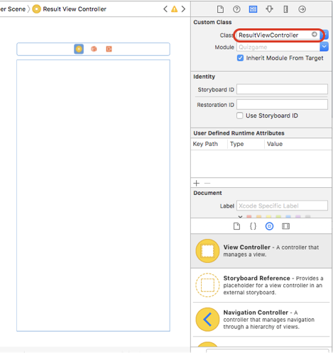

