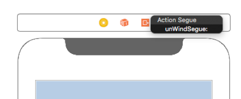
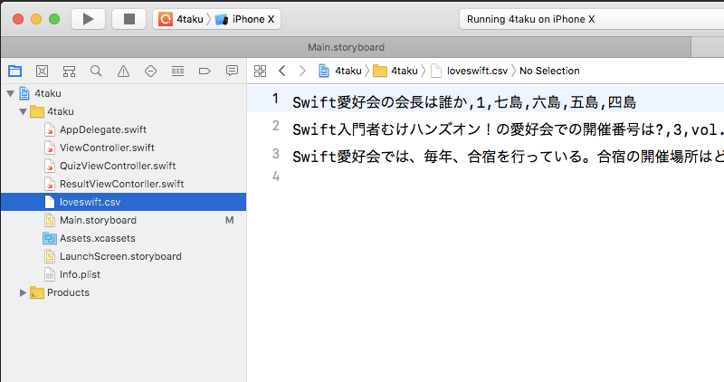
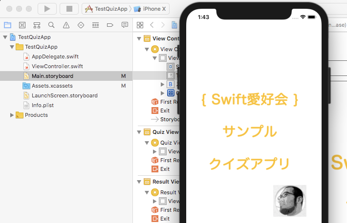

# クイズアプリのコードを配置する

Storyboard の設定が終わったら、画面を動作させるためのプログラムコードを配置する。

## タイトル画面のプログラムコードの設定(ViewController)

- タイトル画面の完成ソースコードのリンクは以下。

	- https://github.com/swift-love/4taku/blob/master/4taku/ViewController.swift

- 以下の部分を追加(18〜20行目)

```
@IBAction func unWindSegue(_ sender: UIStoryboardSegue) {
	print("topwindow")
}
```

- 画面の unWindSegue を、StoryBoard上で結びつける。



- これで、ViewControllerの設定は終了。

## ゲーム画面のプログラムコードの設定(QuizViewController)

- ゲーム画面の完成ソースコードのリンクは以下。

	- https://github.com/swift-love/4taku/blob/master/4taku/QuizViewController.swift

- IBOutlet を追加した下の24行目から以下の部分を追加

```
// 問題を格納
var csvArray:[String] = []
   
// 取り出した問題を格納
var questionArray:[String] = []

// 変数
var questionCount = 0   // 出題数
var correctCount = 0    // 正解

// 定数
let total = 3          // 出題数
let waitQuestion = 0.8  // 表示の間隔
```

- QuizViewController.swift のファイルの終わりの方に、"override func didReceiveMemoryWarning()" と書かれている関数があるので、その手前にCSVファイルの取り込み処理関数を追加する。

```
// CSVファイルの読み込み
func loadCSV(filename : String)->[String] {
	// 返却値の初期化
	var csvStr:[String] = []

	// CSVを読み込んでArrayに
	if let csvPath = Bundle.main.path(forResource: filename, ofType: "csv") {
		do {
			var csvData = try String(contentsOfFile: csvPath,
									encoding: String.Encoding.utf8)
				csvData = csvData.replacingOccurrences(of: "\n", with: "")
				csvStr = csvData.components(separatedBy: .newlines)
		} catch let error as NSError {
			print(error.localizedDescription)
		}
		return csvStr
	}
}
```

- 先ほど追加した func loadCSV() の手前に以下の問題表示の関数を追加する。

```
// 問題表示
func nextProblem() {
    // questionArrayの初期化
    questionArray.removeAll(keepingCapacity: true)
    if questionCount < total {
		// questionArrayに新規問題を格納
       	questionArray = csvArray[questionCount].components(separatedBy: ",")
		// 表示内容をセット
		quizNumberLabel.text = "第\(questionCount+1)問"
		quizQuestionLabel.text = questionArray[0]
		uiButton1.setTitle(questionArray[2], for: .normal)
		uiButton2.setTitle(questionArray[3], for: .normal)
		uiButton3.setTitle(questionArray[4], for: .normal)
		uiButton4.setTitle(questionArray[5], for: .normal)
    } else {
		// 問題を全て表示した後の処理(後で記述)
 	}
}
```

- 先ほど追加した func nextProblem() の手前に正誤判定を追加する。@IBAction の表示はそのままに、{} の記述を追加する。

```
// 正誤判定
@IBAction func btnAction(_ sender: UIButton) {
	// 正解とボタンのタグ番号が同じなら正解
	if sender.tag == Int(questionArray[1]) {
		answerImage.image = UIImage(named: "correct.png")
		correctCount += 1
	} else {
		answerImage.image = UIImage(named: "incorrect.png")
	}

	// 回答表示の有効化(0.8秒間)
	answerImage.isHidden = false
	DispatchQueue.main.asyncAfter(deadline: .now() + waitQuestion) {
		self.answerImage.isHidden = true
	}

	// 次の問題文呼び出し
	questionCount += 1
	nextProblem()
}
```

- Segue を使って値を渡して画面処理の遷移を追加する。func loadCSV() の手前に Segue で値を渡す処理を追加する。

```
// Segue で値を渡す
override func prepare(for segue: UIStoryboardSegue, sender: Any?) {
	let sVC: ResultViewController = (segue.destination as? ResultViewController)!
	sVC.correct = correctCount
}
```

- Segue の画面遷移をする処理を記述する。先ほど追加した中で、func nextProblem()のelseの中にある「// 問題を全て表示した後の処理(後で記述)」を以下の記述に置き換える。

```
// Storyboard Segue の Identifier を引数に定義して画面遷移
DispatchQueue.main.asyncAfter(deadline: .now() + waitQuestion) {
	self.performSegue(withIdentifier: "toResultViewController", sender: nil)
}
```

- 次に、viewDidLoad の中に記述を追加する。"override func viewDidLoad()"の中の super.viewDidLoad() の下に以下の記述を追加する。

```
// 画面が初めて表示されようとするときに動くメソッド
override func viewDidLoad() {
	super.viewDidLoad()

	// 問題の読み込み
	csvArray = loadCSV(filename: "loveswift")

	// 画面の初期化
	answerImage.isHidden = true

	// 問題表示
	nextProblem()
}
```

- これで、QuizViewControllerの設定は終了。

## 結果表示画面のプログラムコードの設定(ResultViewController)

- 結果表示画面の完成ソースコードのリンクは以下。

	- https://github.com/swift-love/4taku/blob/master/4taku/ResultViewContorller.swift

- IBOutlet を追加した下に以下の変数を定義を記述する。

```
// 正解数
var correct = 0
```

- viewDidLoad の中に記述を追加する。"override func viewDidLoad()"の中の super.viewDidLoad() の下に記述を追加し、以下のようにする。

```
override func viewDidLoad() {
	super.viewDidLoad()

	// 正解数を表示
	resultLabel.text = "正解数は、\(correct)問でした。お疲れさまでした。"

	// 合格・不合格判定
	if correct >= 3 {
		resultImageView.image = UIImage(named: "passLogo.png")
	} else {
		resultImageView.image = UIImage(named: "failLogo.png")
	}
}
```

- これで、ResultViewControllerの設定は終了。

## クイズの問題を取り込む

- Xcodeのプロジェクトにダウンロードしたクイズの問題を取り込む



## 動作確認

- Xcode の上の方で、「▶」を押して、iPhone X のシミュレーターを起動して表示を確認する


